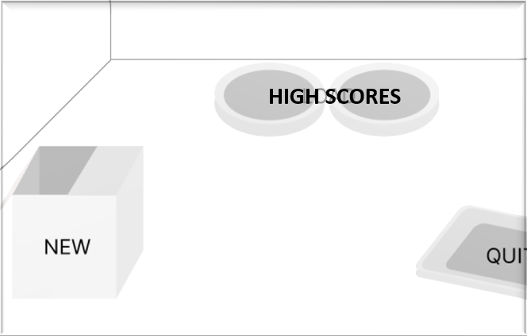
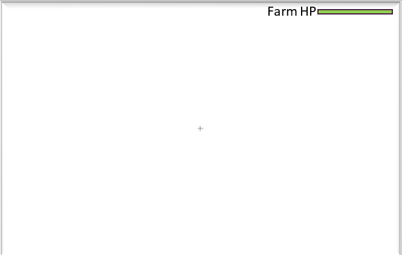
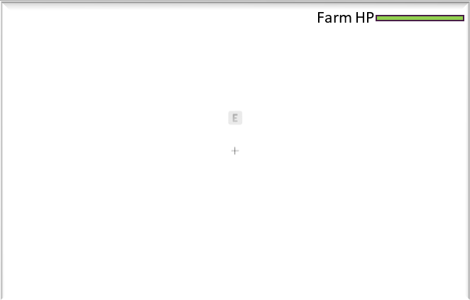
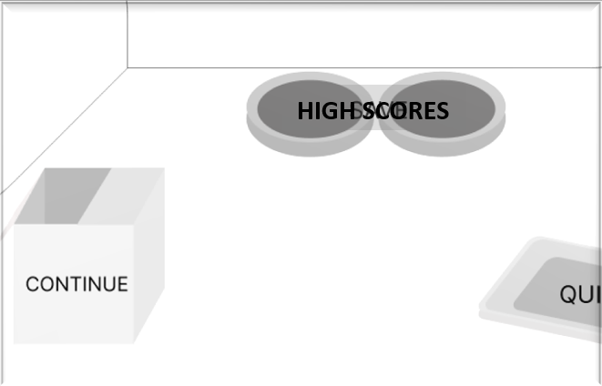
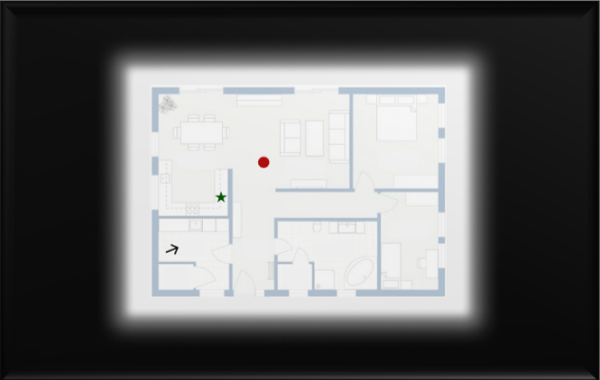

# **Project Rem**

***Designed and Programmed by Michaela O'Brien***

***Last Review: 3/04/2023***

***

Contents

  
- [Table of Contents](https://github.com/mikkie423/ProjectRem/edit/main/README.md#table-of-contents)

- [Executive Summary](https://github.com/mikkie423/ProjectRem/edit/main/README.md#executive-summary)

  - [Mission Statement](https://github.com/mikkie423/ProjectRem/edit/main/README.md#mission-statement)
  
  - [High Concept](https://github.com/mikkie423/ProjectRem/edit/main/README.md#high-concept)
  
  - [Unique Selling Points](https://github.com/mikkie423/ProjectRem/edit/main/README.md#unique-selling-points)
    
- [Project Parameters](https://github.com/mikkie423/ProjectRem/edit/main/README.md#project-parameters)
  
   - [Parameters](https://github.com/mikkie423/ProjectRem/edit/main/README.md#project-parameters)
  
   - [Target Audience](https://github.com/mikkie423/ProjectRem/edit/main/README.md#target-audience)

- [Gameplay Overview](https://github.com/mikkie423/ProjectRem/edit/main/README.md#gameplay-overview)

  - [Core functionality/Mechanics](https://github.com/mikkie423/ProjectRem/edit/main/README.md#core-functionality--mechanics)
  
  - [Features](https://github.com/mikkie423/ProjectRem/edit/main/README.md#features)
  
- [UI Wireframes](https://github.com/mikkie423/ProjectRem/edit/main/README.md#ui)
  
  

  
  ***

## Executive Summary

### Mission Statement
Make a fun, feline-inspired, 3D, first-person wave-based defense game that juggles cat simulation, platforming and searching for and combining items to activate warp tunnels to help protect the crops by removing the rats attacking them.

### High Concept
As the night falls, the rats come out to eat. The cats come out to hunt. Chase and hunt as many rats as possible that spawn throughout the night, protecting the farm as best as possible from these devious rodents. When dawn breaks, the hunt is over and the score is tallied up and added to the High Score Board if it’s better than previous hunters scores. If the farm gets destroyed before dawn breaks then the player is defeated and no score goes on the High Score Board.

Experience platforming and scaling objects from a brand new, tiny, furry perspective. Explore as a kitten while finding items to interact with. Combine different items to learn recipes for warp tunnels through the cat dimension, allowing for quick travel to other locations while on the hunt for rats destroying the farms crops. Whether you prefer chasing and attacking rats, kneading on some nice comfy blankets, jumping in boxes, scratching on posts, knocking things off shelves, or somehow appearing in a weird location, you will always have something to do and some way to get the jump on all the rats.

### Unique Selling Points

-	Viewing the world from a kitten’s perspective.
-	Jump on and climb things.
-	Interacting with items as a kitten, such as playing with a ball of yarn or picking up a toy and running around, and attacking rats.
-	Learning the different combinations of items to activate warp tunnels to different locations.
-	Warping from one place to another
-	Meow and Purr whenever you want to.
-	Be the best Kitten rat-hunter around.

***

## Project Parameters

|  Constraint | Description |
| ------------- | ------------- |
|***Project duration:*** | 8 weeks |
|***Alpha due:***|  21/04/2023 |
|***Engine:*** | Unity Engine - 3D Core, v2021.3.20f1 |
|***Target Platforms:*** | Windows PC |
|***Primary Programming Language:*** |C#|
|***Team Size:*** | 1 Person to do it all|
|***Budget:*** | $1200.00|

### Target Audience:

My target audience would be both male and female casual PC gamers, ages 15-30 years old. This is because both males and females would enjoy playing as a kitten and trying to get a high score, however, the males may be more drawn to attacking the rats as they can prefer fighting and action wave-based rounds; the females may be more drawn towards defending the fields in other ways rather than just attacking every rat. The age range is because there is a small amount of fighting the rats and so younger children won’t be able to play and as most people get older, they can lose interest in games in favour of other things like settling down with a family and being busy with careers.

The income of the demographic would be the lower/middle class as people with more income will tend to want to spend more to prove they have money. The lower and middle class will tend to buy what is needed and what is wanted to help pass the time. The target audience will probably be full-time students that may be working a part-time job or people with repetitive full-time jobs such as office, manufacturing, or retail which get very boring and monotonous driving the target audience towards wanting to find some excitement or escapism in gaming.

***

## Gameplay Overview

*Act like a kitten to find and obtain the treats.*

### Core Functionality / Mechanisms

-	Walk forward, backward, left, and right in a 3D space [WASD/Arrow Keys]
-	Sprint forward, backward, left, and right in a 3D space [WASD/Arrow Keys while holding Shift]
-	Look left, right, up, and down in a separate way to moving around [Mouse]
-	Climb up/down certain objects (trees, curtains, etc.) by walking up to them and walking up [W]
-	Jump onto objects [Space]
-	Interact with items on a button click [E]
-	Pick up certain items, only one item at a time [E]
-	Save time to a high score system after each round.
-	Footsteps, audio, and music to sound cool, mostly calm until it’s suddenly not, with matching music/audio cues.

### Features
-	Rats to hunt [Left Mouse to attack from left, Right Mouse to attack from right]
-	Drop an item onto a detector to activate a certain warp tunnel [E on item to pickup, E to drop item on detector]
-	Warp from one location to another [Walk into the Portal]
-	Meow on the press of a button [V]
-	Purr on the press of a button [C]
-	Show the mind map to help gauge the level and where threats on button press [Tab]

## UI
As the main focus of the game is to take inspiration from being a kitten exploring the world, the HUD and UI in general will be quite minimal. The only constant on the screen will be a crosshair to assist the user in knowing where they are aiming for jumps and interacting with objects, and the health of the farms the user is defending from rats. Interaction cues will appear onscreen when the user is looking at an interactable item, the cues will be a small bubble with the interaction button icon/letter showing, and when looking at a rat their health bar will show above them. The UI will have soft natural colours to encourage the farm feel of the environment. It will be a little farm and cat inspired but still quite basic and minimalist.

#### Main Menu

The Main Menu will move with the cursor, slightly left and right and very slightly up and down. As the user moves their cursor towards the Quit option the camera moves with the cursor making the Quit option become more visible and the New option moving slightly out of frame. This design choice of a moving Main Menu screen was made to help immerse the user in the idea of being a kitten in the world and the way looking at everything will feel. It is also to help make it stand out and be unique.

***

#### HUD

The HUD will be very minimal with only a crosshair in the middle of the screen to assist the user in knowing where they may be looking at, what they might be interacting with or where they might be jumping to. This is common practice in the industry of first-person games as users need to know where their center point is at all times for the pace of action that occurs in first-person views. It also has the overall farm health visible at the top.

***

#### HUD - with avaiable interaction

When the user has an interaction available, a shape representing the physical button will show on screen with an icon/word telling the user what button to use.

***

#### Pause Menu

Very similar to the Main Menu, except instead of a New game option it is a Continue option which just resumes the game from where it was paused.

***

#### Mind Map

The Mind-Map is the map in the mind of the cat the user plays, The background around the map is black because the cat character closes its eyes to remember the map. The Red Dots on Figure 5 are a rat to hunt, the Green Star is a known warp tunnel, and the black arrow is representing the user’s character and the direction the are facing.
